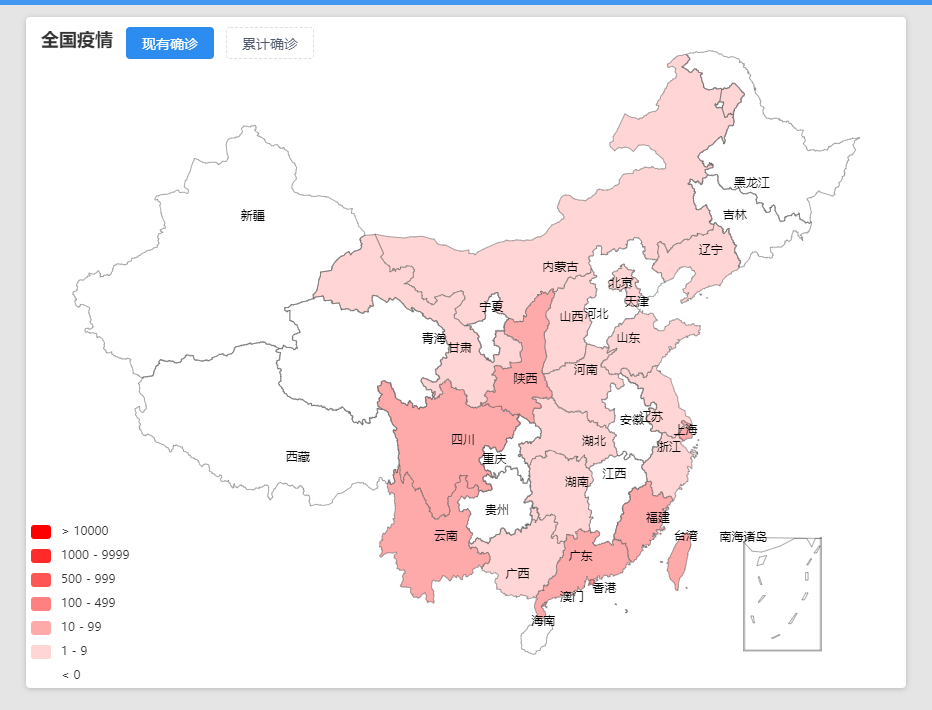

# yq-screen

> PS: 疫情数据来源：[实时更新：新冠肺炎疫情最新动态](https://news.qq.com/zt2020/page/feiyan.htm#/newsList)

## 项目启动
- koa-serve文件夹为后端项目
- front文件夹为前端项目 
（需要同时启动前后端服务，项目才能正常运行）

### 第一步：启动后端服务
- 进入koa-serve文件夹
- 安装项目依赖： `npm install` 
- 启动后端服务： `node app.js`

### 第二步：启动前端服务
- 进入front文件夹
- 安装项目依赖： `npm install`
- 启动前端服务： `npm run serve`

## 项目功能介绍
- 最新进展
- 全国疫情地图
  - ### 可查看全国现有确诊、累计确诊
  
  
  - ### 点击省份可以查看该省份的疫情情况
  
- 疫情数据表格展示
- 全国现有确诊趋势
- 全国疫情累计趋势
- 全国疫情新增趋势
- 治愈率/死亡率
